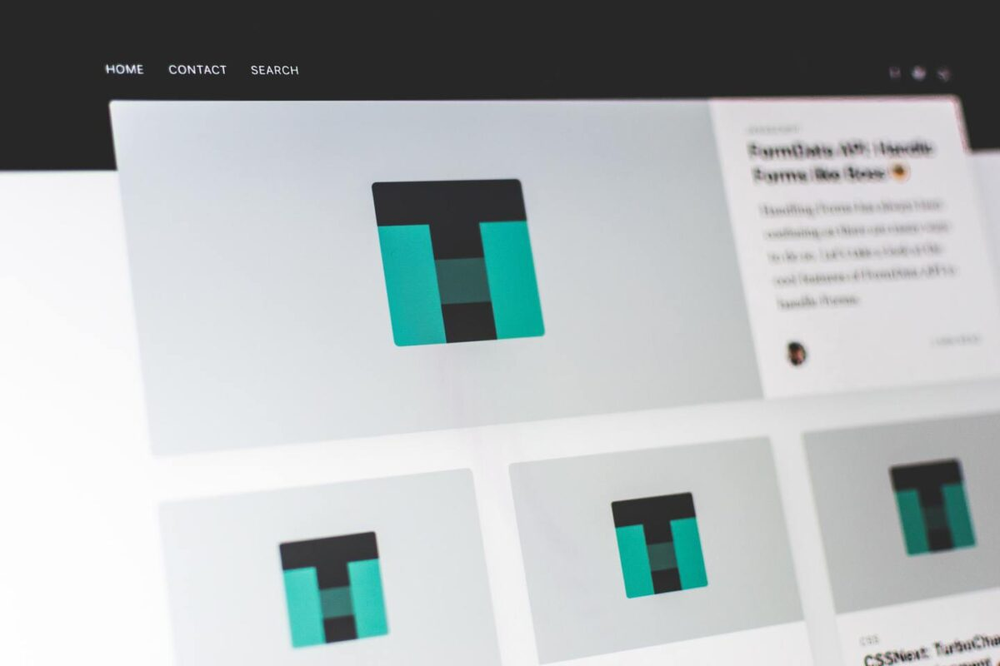

# HTML & CSS | ADVANCED CSS | PROJECT: DESIGN YOUR OWN GRID-BASED FRAMEWORK

## Assigment Git Workflow

- Step one: Pull the assignment to your local machine
- Step two: Start Coding
- Step three:git add / git commit / git push
- Step four: Create a pull request back to your branch
- step five: Submit pull request url in Athena platform

! IMPORTANT: You will need to create a Pull Request merging back into your own repository's main branch and NOT the main repository (SocialHackersAcademy).

#### INSTRUCTIONS

You'll be creating your own grid-based framework.

1. Create a new CSS document.

2. Think about the major elements that are required of a framework. This includes a CSS reset, a fixed number of grids separated by "gutters", a way to make new rows, and default values for the font properties of elements.

3. Write the CSS necessary to create a basic 12-column grid framework. Check out the [960 Grid System documentation](http://960.gs) for a look at how they do it. The complexity is up to you -- there's no need to go too crazy with details (you're not trying to rebuild Bootstrap).

4. Applying the Framework

4.1. Create a new HTML document and a new Github repository.

4.2. Identify the webpage you'd like to clone and break it down into its major elements like we have in the previous projects.

4.3. Add your framework to your project.

4.4. Use your framework to lay out the structure of the page.

4.5. Fill in the necessary details/images etc.

4.6. Commit the changes on a new branch and create a Pull Request

4.7. Have a frosty beverage, you're done with the HTML/CSS projects!

---

_Photo by Pankaj Patel on Unsplash_
